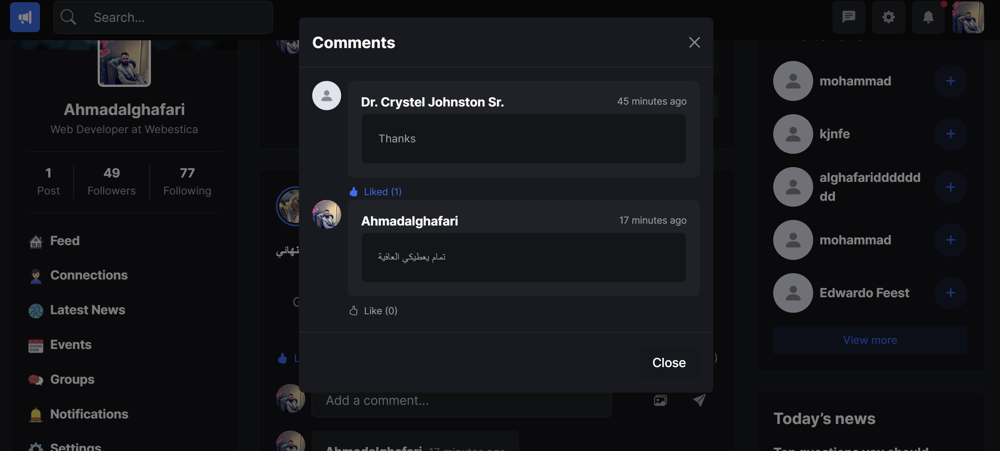
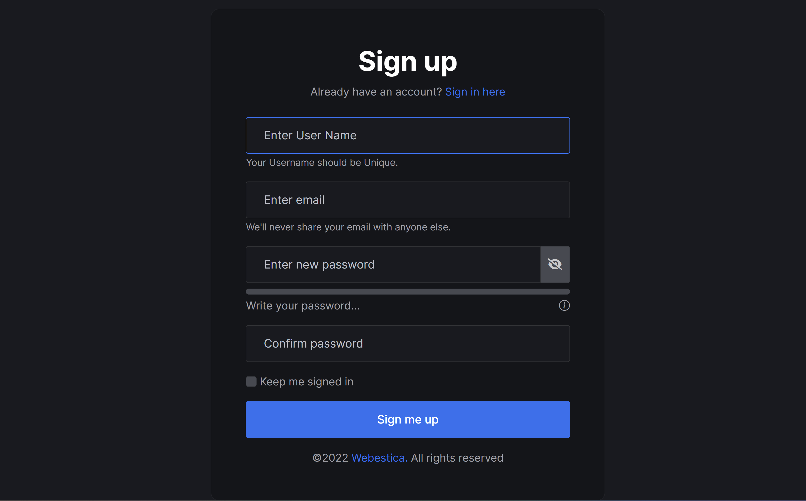
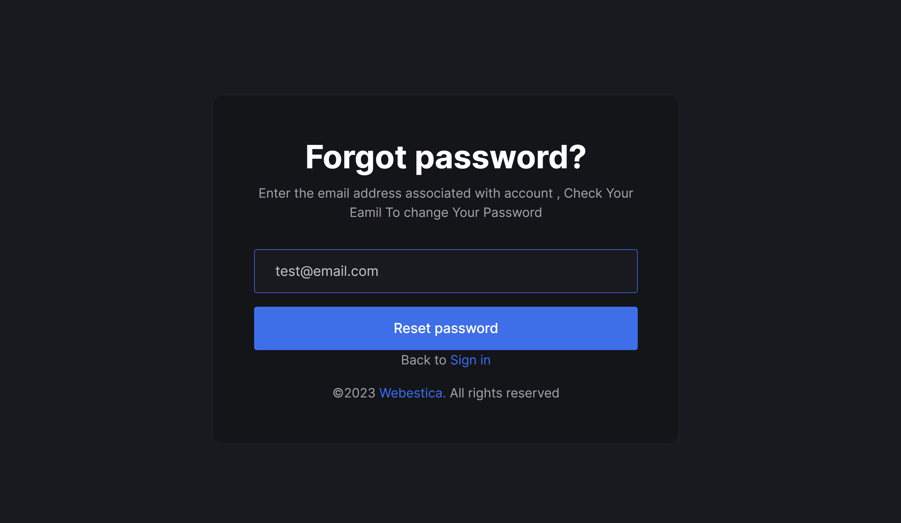
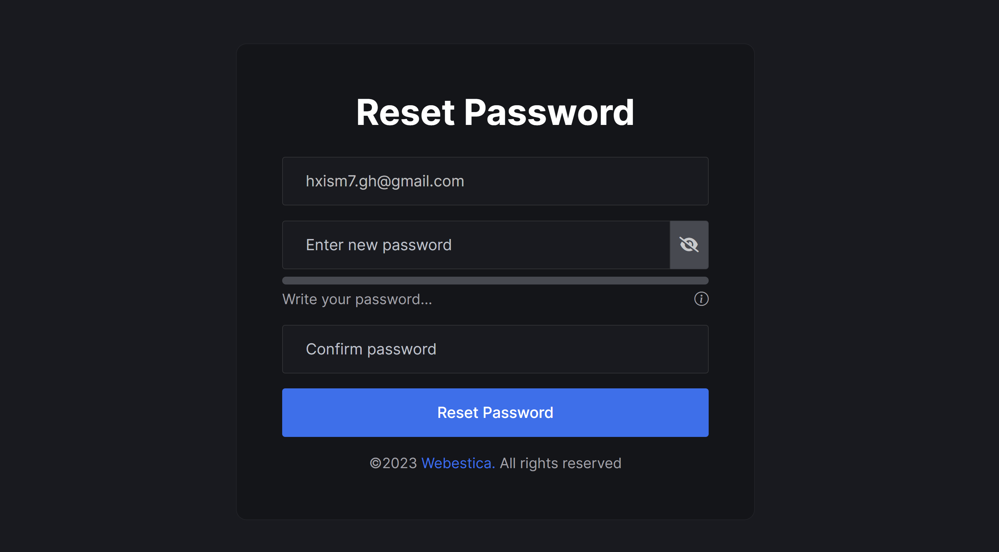
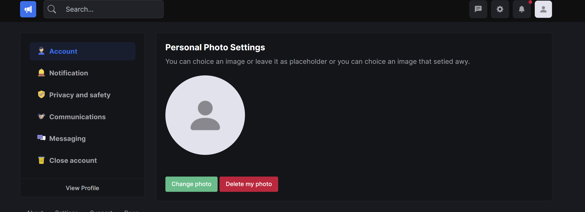
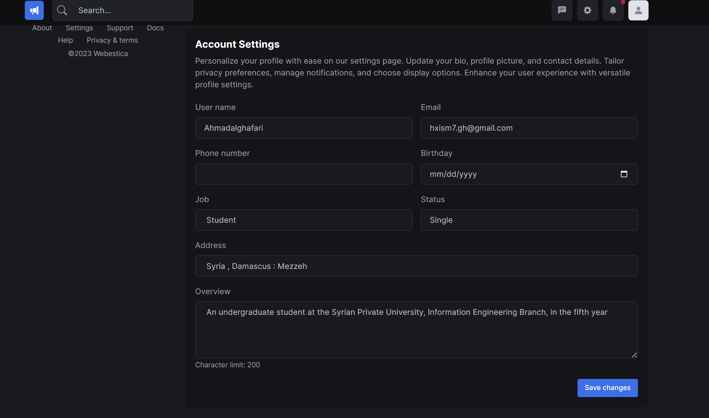
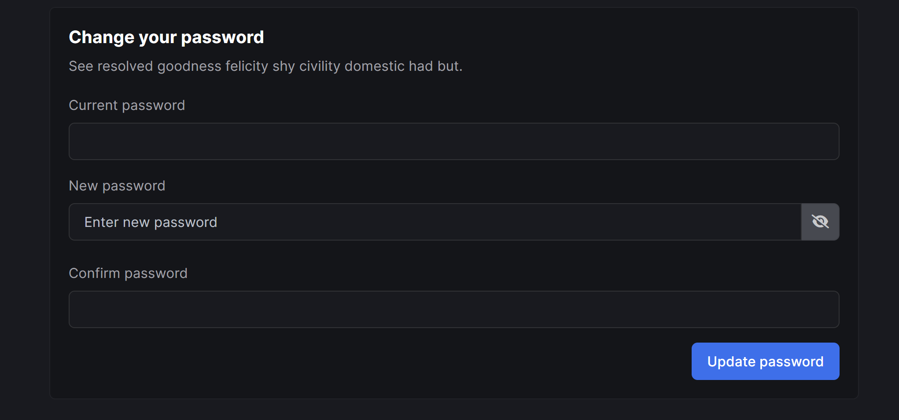
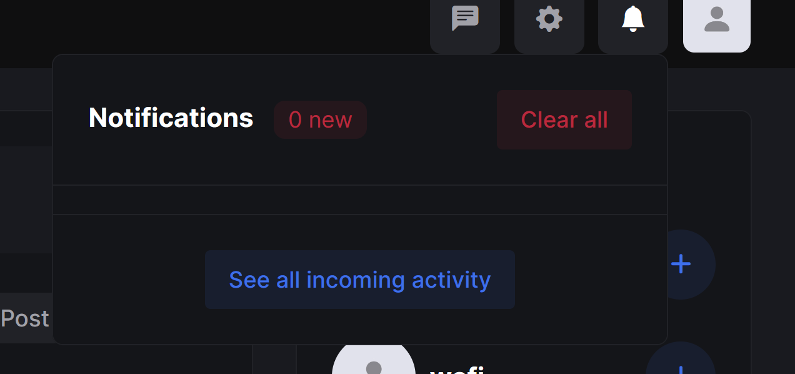

# HomeRoutingPage
A directing page that contains a communication site within it, from which the user navigates between the domains provided by this directed page, or chooses to publish on the same public site, or create his own domain.

 
 
 
 
 
 
 
 
 
 
 
 
 
 
 
 
 
 